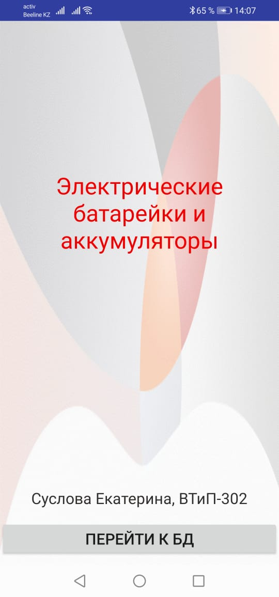
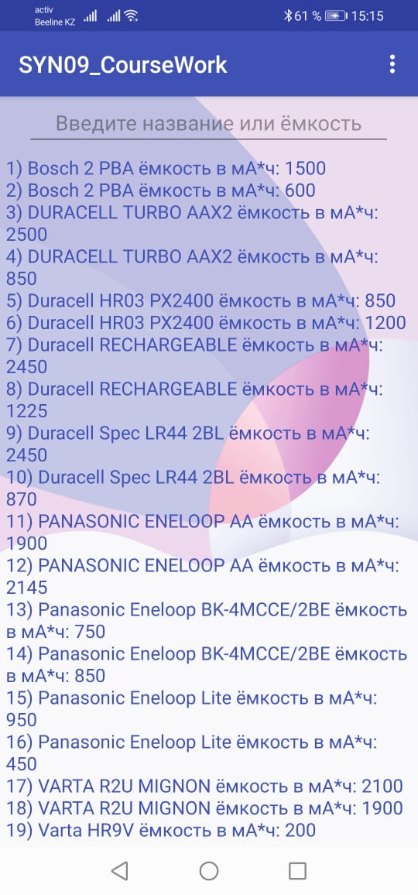
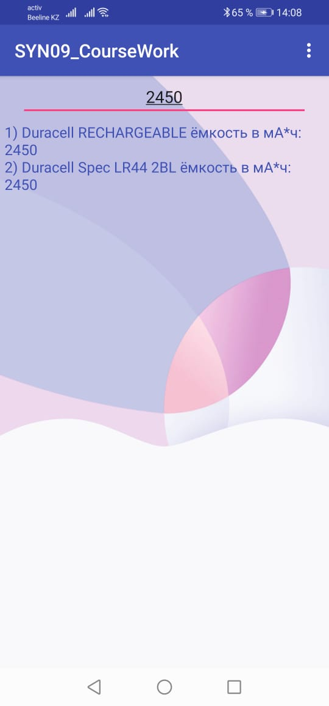
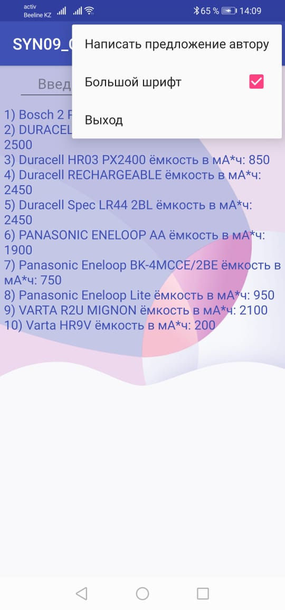

# Курсовая работа "Разработка многооконного мобильного приложения для Android с использованием базы данных SQLite"
## Вариант 9 - Предметная область "Электрические батарейки и аккумуляторы"

### Первое окно программы

### Второе окно программы

### Поиск по ёмкости

### Меню программы

### Отправка сообщения автору с предложением

